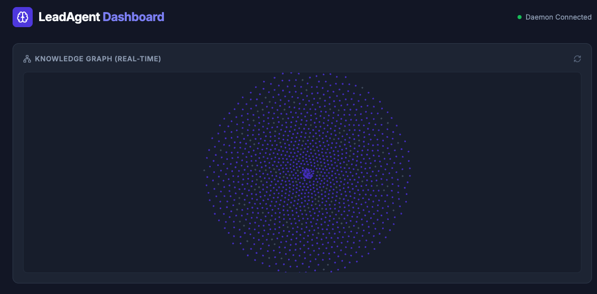

# LeadAgent: Universal CLI Orchestrator

Route any prompt to Claude, Gemini, or OpenAI from a single terminal command — using your existing subscriptions, with full cross-project memory and zero per-token cost.

> **Not a replacement for Aider, Cursor, or your existing dev tools.** LeadAgent is a "Global Brain" that sits at the OS level, providing shared memory across all your projects.

## Visual Tour

### Agent Routing


### Knowledge Graph


### MCP Tool Rules


## Privacy Guarantee

- **Local-only data** — your knowledge graph (KuzuDB) lives on your machine; nothing is sent to LeadAgent servers
- **No telemetry** — zero tracking, no analytics, no usage reporting
- **User-space daemon** — runs as your own user, no root, no system services
- **What the watcher indexes** — file paths and git metadata only; source content is never stored

## Quick Start

Requires Python 3.10+, Go 1.25+, and at least one AI provider CLI (`claude` or `gemini`).

```bash
git clone https://github.com/your-username/LeadAgent.git
cd LeadAgent
./install.sh
```

Verify the daemon is running:

```bash
leadagent health
# → backend: ok  agentmemory: ok  ollama: ok (if installed)
```

Open the dashboard: [http://localhost:5173](http://localhost:5173)

Send your first prompt:

```bash
# From any project directory
leadagent "Explain the architecture of this project"
leadagent "Refactor this module" --agent claude
leadagent debate "Microservices vs Monolith for this MVP?"
```

> Add `alias leadagent='/path/to/LeadAgent/cli/leadagent'` to your `.zshrc` to invoke globally.

## Docker

Run the full stack in isolation without committing to a native daemon:

```bash
docker compose up -d --build
leadagent health
```

## Why LeadAgent?

- **Zero Marginal Cost** — routes through your existing subscription CLIs, no API keys needed
- **Cross-Project Memory** — local [KuzuDB](http://kuzudb.github.io/docs) graph remembers decisions and history across repos
- **State-Aware Routing** — task affinity scoring + deterministic fallback DAGs for autonomous recovery
- **Privacy-First** — your knowledge graph lives entirely on your machine
- **Editor Agnostic** — works alongside any IDE via the terminal and MCP interface

## How It Works

```
prompt
  └─► brain (memory check + complexity score)
        └─► router (agent + mode selection)
              └─► CLI (claude / gemini / codex)
                    └─► stream back to terminal
                          └─► memory update (KuzuDB graph)
                                └─► dashboard (live metrics)
```

1. **Brain** checks project memory for relevant context
2. **Router** scores task affinity across enabled agents and picks the best fit
3. **CLI** runs in `plan` (text) or `execute` (tool use / agentic) mode
4. **Stream** is relayed token-by-token with status heartbeats
5. **Memory** stores the outcome in the local knowledge graph
6. **Dashboard** updates usage, ROI, and session history in real time

## Daemon Management

```bash
./start_backend.sh              # start in foreground (debug)
./start_backend.sh --daemon     # start in background
./start_backend.sh backend      # restart only the FastAPI backend
leadagent --onboarding          # re-run setup wizard
tail -f leadagent-data/daemon.log
```

## Contributing

Open engineering surfaces:

- **ML Brain** — LightGBM + MiniLM joint classifier for agent + mode routing
- **New Adapters** — add support for additional CLI-based AI providers
- **Dashboard** — React/Vite frontend at `frontend/`
- **MCP Rules Engine** — structural tool enforcement at `backend/mcp_rules.py`

## Docs

- [Architecture & Flow](docs/architecture.md) — routing pipeline, MCP layer, context discovery, full diagram
- [MCP Rules](docs/mcp-rules.md) — structural tool enforcement: block, allow, or escalate before the agent ever sees a capability
- [Debate Engine](docs/debate.md) — GAN-style adversarial multi-agent debates with umpire synthesis
- [Docker Setup](docs/docker.md) — Docker vs native mode, auth troubleshooting
- [Open Source Credits](docs/credits.md) — dependencies and related projects

## Reset

```bash
./nuke.sh   # wipe environment and start fresh
```

---
*Open-source under the [MIT License](LICENSE). Orchestration should be neutral, auditable, and vendor-agnostic.*
