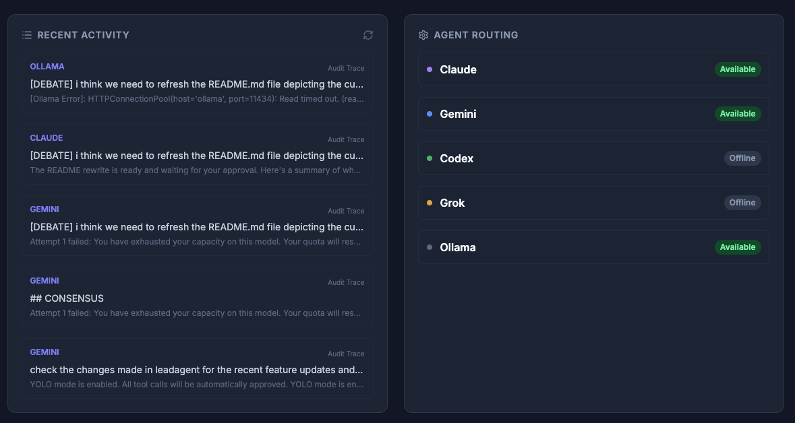
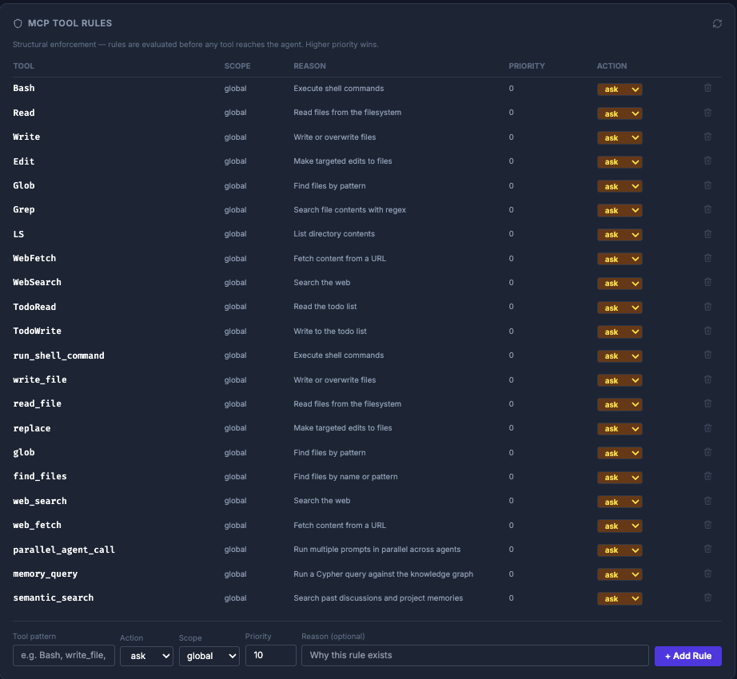

# LeadAgent: Universal CLI Orchestrator

Route any prompt to **Claude**, **Gemini**, **Codex**, or **Grok** from a single terminal command — using your existing subscriptions, with full cross-project memory and zero per-token cost.

> **Latest Release: v0.7.0** — Interactive knowledge graph, dual-tier semantic memory, httpOnly cookie auth for the dashboard, and hardened debate engine.

> ⚠️ **Upgrading from v0.6.x or lower versions? Fresh install recommended.** Docker container labels changed and the KuzuDB schema was updated. See [Upgrading to v0.7.0](#upgrading-to-v070-recommended-fresh-install) below.

## Visual Tour

### Agent Routing


### Knowledge Graph


### MCP Tool Rules


## Privacy Guarantee

- **Local-only data** — your knowledge graph (KuzuDB) lives on your machine; nothing is sent to LeadAgent servers
- **No telemetry** — zero tracking, no analytics, no usage reporting
- **User-space daemon** — runs as your own user, no root, no system services
- **What the watcher indexes** — file paths and git metadata only; source content is never stored

## Quick Start

Requires Python 3.10+, Go 1.25+, and at least one AI provider CLI (`claude` or `agy`).

```bash
git clone https://github.com/your-username/LeadAgent.git
cd LeadAgent
./install.sh
```

Verify the daemon is running:

```bash
leadagent health
# → backend: ok  agentmemory: ok  ollama: ok (if installed)
```

If something looks wrong, run the full environment diagnostic:

```bash
leadagent doctor
```

This checks local prerequisites (python3, go, npm), backend reachability, agent authentication, AgentMemory, and Ollama — and prints a pass/fail row for each with a fix hint.

Open the dashboard: [http://localhost:8000/dashboard](http://localhost:8000/dashboard) — you will be redirected to a login page; enter your API key (stored in `leadagent-data/api.key`) once to receive a session cookie valid for 8 hours.

Send your first prompt:

```bash
# From any project directory
leadagent "Explain the architecture of this project"
leadagent "Refactor this module" --agent codex
leadagent debate "Microservices vs Monolith for this MVP?"
```

> Add `alias leadagent='/path/to/LeadAgent/cli/leadagent'` to your `.zshrc` to invoke globally.

## Docker

Run the full stack in isolation without committing to a native daemon:

```bash
./start_backend.sh --daemon
leadagent health
```

> **Don't run `docker compose up` directly.** The compose file mirrors your
> projects workspace into every container via `LEADAGENT_WORKSPACE`, which
> `start_backend.sh` exports from `leadagent-data/config.json` (set during
> onboarding). A raw `docker compose up` from a shell without that variable
> silently mounts `/tmp` instead — agents will no longer see your projects.
> If you must use compose directly, export the variable first:
>
> ```bash
> export LEADAGENT_WORKSPACE="$(grep -o '"projects_dir": "[^"]*' leadagent-data/config.json | cut -d'"' -f4)"
> docker compose up -d --build
> ```

## Why LeadAgent?

- **Zero Marginal Cost** — routes through your existing subscription CLIs (Claude Code, OpenAI Codex, xAI Grok, Google Antigravity/Gemini), no API keys needed
- **Cross-Project Memory** — local [KuzuDB](http://kuzudb.github.io/docs) graph remembers decisions and history across repos
- **Live Debate Engine** — adversarial multi-agent collaboration with real-time status and umpire synthesis
- **Privacy-First** — your knowledge graph lives entirely on your machine
- **Editor Agnostic** — works alongside any IDE via the terminal and MCP interface

## Features in v0.7.0

- **Interactive Knowledge Graph**: Click any node to inspect source, type, and connections. Double-click a node to forget it. Filter by node type (entity / concept / file / episodic / semantic), search by name, freeze physics, and refresh live. Color-coded legend distinguishes KuzuDB entities from AgentMemory semantic/episodic memories.
- **Dual-Tier Memory**: Every completed Q&A pair is written to **episodic** memory; debate consensus and distilled knowledge go to **semantic** memory. Both layers are surfaced in the graph and retrieved on future prompts.
- **AgentMemory in Graph**: The knowledge graph now includes `agentmemory` nodes (episodic and semantic) alongside KuzuDB entities, auto-linked where entity names appear in memory content.
- **Secure Dashboard Login**: The dashboard is now protected by an httpOnly session cookie (`la_session`, 8-hour expiry). No more query-param key passing — browser JS never sees the key or token.
- **Force-Global Debate Memory**: `--no-context` debate mode uses cross-project semantic memory (global scope) so agents aren't tunnel-visioned by local project context.
- **Antigravity (agy) Integration**: Gemini now routes through Google's new `agy` CLI — supports Gemini 3.5 Flash and 3.1 Pro with automatic model fallback.
- **Full Agent Parity**: Robust support for Claude, Gemini (via `agy`), Codex, and Grok.
- **Async Debate Streaming**: Watch agents argue in real-time with live status updates.
- **Self-Healing Routing**: Automatic fallback to alternative agents on quota exhaustion or errors.
- **Enhanced CLI UX**: Full `Ctrl+C` / `Ctrl+Z` support, live reasoning snippets, and dual-port (8000/8001) backend detection.
- **Memory Hygiene**: Use the `/forget` command to prune stale project knowledge.

## How It Works

```
prompt
  └─► brain (memory check + complexity score)
        └─► router (agent + mode selection)
              └─► CLI (claude / gemini / codex)
                    └─► stream back to terminal
                          └─► memory update (KuzuDB graph)
                                └─► dashboard (live metrics)
```

1. **Brain** checks project memory for relevant context
2. **Router** scores task affinity across enabled agents and picks the best fit
3. **CLI** runs in `plan` (text) or `execute` (tool use / agentic) mode
4. **Stream** is relayed token-by-token with status heartbeats
5. **Memory** stores the Q&A pair in episodic memory (KuzuDB + AgentMemory) and extracts entities into the knowledge graph
6. **Dashboard** updates usage and session history in real time; the interactive graph shows all memory layers

## Daemon Management

```bash
./start_backend.sh              # start in foreground (debug)
./start_backend.sh --daemon     # start in background
./start_backend.sh backend      # restart only the FastAPI backend
leadagent --onboarding          # re-run setup wizard
leadagent health                # quick status check
leadagent doctor                # full environment diagnostic (auth, memory, models)
tail -f leadagent-data/daemon.log
```

## Updating

To update to the latest version of LeadAgent:

```bash
git pull origin main
./install.sh
```
This will automatically rebuild the CLI, refresh your Docker containers, and pull any new local models (like Ollama's Llama 3.2).

### Upgrading to v0.7.0 (recommended: fresh install)

v0.7.0 includes KuzuDB schema changes (new `session_id` column on `Question` nodes) and Docker resource labels were added to all containers. If you are running a previous version, the cleanest path is a full reset:

```bash
# 1. Remove old containers and volumes (Docker labels changed — compose may not recognise existing resources)
docker compose down -v
docker rm -f $(docker ps -aq --filter "name=leadagent") 2>/dev/null || true

# 2. Wipe local state (graph DB, config, usage cache)
./nuke.sh

# 3. Pull and reinstall
git pull origin main
./install.sh
```

> If you want to keep your knowledge graph, back up `leadagent-data/graph/` before running `nuke.sh`. The KuzuDB migration in v0.7.0 is additive (`ALTER TABLE ... ADD COLUMN` with a default), so an existing graph *may* survive, but it has not been tested against all older schema versions.

### Upgrading to v0.6.0 (breaking change)

Google deprecated `@google/gemini-cli`. LeadAgent now uses the Antigravity CLI (`agy`):

```bash
# 1. Install agy on your host
curl -fsSL https://antigravity.google/cli/install.sh | bash

# 2. Rebuild the Gemini container
docker compose build gemini-agent
docker compose up -d gemini-agent

# 3. Re-run onboarding to authenticate
leadagent --onboarding
```

## Slack Bot (Optional)

LeadAgent ships an optional Slack bot that brings `/debate` and `@LeadAgent` mention support directly into your workspace. It is a standalone process — the main backend runs fine without it.

### 1. Create a Slack App

1. Go to [api.slack.com/apps](https://api.slack.com/apps) → **Create New App** → **From scratch**
2. Under **OAuth & Permissions** → **Scopes** → **Bot Token Scopes**, add:
   - `chat:write`
   - `commands`
   - `app_mentions:read`
3. Under **Socket Mode**, enable Socket Mode and generate an **App-Level Token** with scope `connections:write` — this becomes `SLACK_APP_TOKEN`
4. Under **Slash Commands**, create `/debate` pointing to your app
5. Under **Event Subscriptions** → **Subscribe to bot events**, add `app_mention`
6. Install the app to your workspace — copy the **Bot User OAuth Token** (`xoxb-...`) as `SLACK_BOT_TOKEN`

### 2. Configure

Add to `backend/.env` (or export in your shell):

```env
SLACK_BOT_TOKEN=xoxb-...
SLACK_APP_TOKEN=xapp-...
```

### 3. Run

```bash
python3 -m backend.slack_bot
```

Or alongside the backend:

```bash
./start_backend.sh --daemon
python3 -m backend.slack_bot
```

### Usage

| Trigger | What it does |
|---|---|
| `/debate Should we use React or Vue?` | Starts a 3-round multi-agent debate, posts each agent's position as a thread reply |
| `@LeadAgent debate <topic>` | Same as above via mention |
| `@LeadAgent <anything else>` | Returns a usage hint |

Debate results stream into the channel in real time — each agent's position and the umpire question appear as thread replies, with a final synthesis posted at the end.

## Contributing

Open engineering surfaces:

- **ML Brain** — LightGBM + MiniLM joint classifier for agent + mode routing
- **New Adapters** — add support for additional CLI-based AI providers
- **Dashboard** — React/Vite frontend at `frontend/`
- **MCP Rules Engine** — structural tool enforcement at `backend/mcp_rules.py`

## Docs

- [Architecture & Flow](docs/architecture.md) — routing pipeline, MCP layer, context discovery, full diagram
- [MCP Rules](docs/mcp-rules.md) — structural tool enforcement: block, allow, or escalate before the agent ever sees a capability
- [Debate Engine](docs/debate.md) — GAN-style adversarial multi-agent debates with umpire synthesis
- [Docker Setup](docs/docker.md) — Docker vs native mode, auth troubleshooting
- [Open Source Credits](docs/credits.md) — dependencies and related projects

## Reset

```bash
./nuke.sh   # wipe environment and start fresh
```

---
*Open-source under the [MIT License](LICENSE). Orchestration should be neutral, auditable, and vendor-agnostic.*
