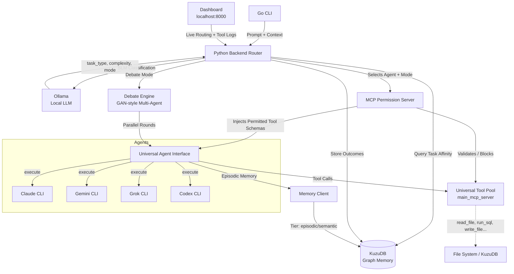

# Architecture & Flow

LeadAgent is a structural mediator between your intent and the tools required to fulfill it — not just a prompt router.



## The Agent Router

LeadAgent uses a multi-tier routing system (`backend/router.py`) to pick the best model — but it is never a black box:

- **Explicit Control:** Force a specific agent via `--agent claude` or natural language (`"Ask Gemini to summarize..."`).
- **Auto-Routing:** When no agent is specified, the system classifies the task using local regex heuristics or a zero-cost Ollama pass, then queries KuzuDB for **Affinity** — matching the task to the model that has historically performed best on similar prompts.
- **Observability:** The real-time dashboard (`http://localhost:8000/dashboard`) shows exactly which agent was selected and why (e.g., `[claude] matched: complexity=high, task=coding`).

## The MCP Rules Layer

Every tool call passes through the rules engine **before** the user is ever prompted. The evaluation chain is:

```
Agent tool call
    └─► Rules Engine (backend/rules.py)
            ├─ ALLOW  → tool executes immediately, no prompt
            ├─ DENY   → tool blocked, reason returned to agent
            └─ ASK    → forwarded to user permission prompt
```

Rules are stored in KuzuDB (`MCPRule` nodes) and evaluated in priority order. Each rule has:

| Field | Description |
|---|---|
| `tool_pattern` | Exact name or glob — `"write_file"`, `"bash*"`, `"*"` |
| `action` | `allow` / `deny` / `ask` |
| `scope` | `global`, `agent:<name>`, `session:<id>` |
| `input_match` | JSON key:value pairs that must all match the tool input |
| `priority` | Higher wins; ties broken by creation order |
| `reason` | Shown to the agent when denied |

**Manage rules via the API:**
```bash
# List all rules
curl http://localhost:8000/rules

# Deny all shell execution globally
curl -X POST http://localhost:8000/rules \
  -H 'Content-Type: application/json' \
  -d '{"tool_pattern":"bash*","action":"deny","scope":"global","reason":"Shell blocked by policy","priority":100}'

# Allow file reads without prompting
curl -X POST http://localhost:8000/rules \
  -d '{"tool_pattern":"read_file","action":"allow","scope":"global","priority":10}'

# Delete a rule
curl -X DELETE http://localhost:8000/rules/<id>
```

**Key properties:**
- **Bypass resistance** — enforcement runs in Python outside the LLM's reasoning loop; prompt engineering cannot override it.
- **Agent-agnostic** — the same rule blocks Claude, Gemini, and Grok equally.
- **Fail-open to user** — if the rules service is unavailable, the call falls through to the user permission prompt rather than silently allowing or blocking.

→ See [MCP Rules](mcp-rules.md) for the full guide: rule fields, example sets, and why prompt instructions are not a substitute.

## Universal Context Discovery

When you run `leadagent` from any directory:

1. **Auto-Discovery:** Identifies the nearest `.git` or project root.
2. **Context Injection:** Snapshots local file structure and relevant symbols.
3. **Graph Indexing:** Incrementally builds a relationship map in KuzuDB, so you can ask *"How did I solve that auth bug in my other project?"*
